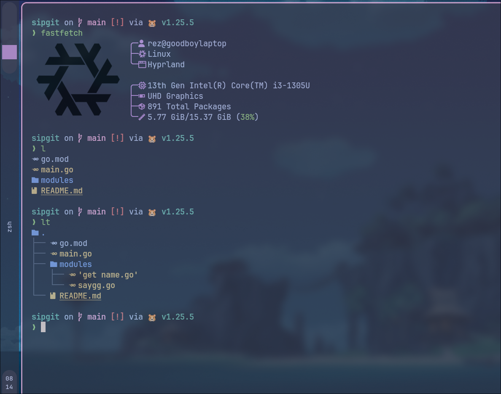
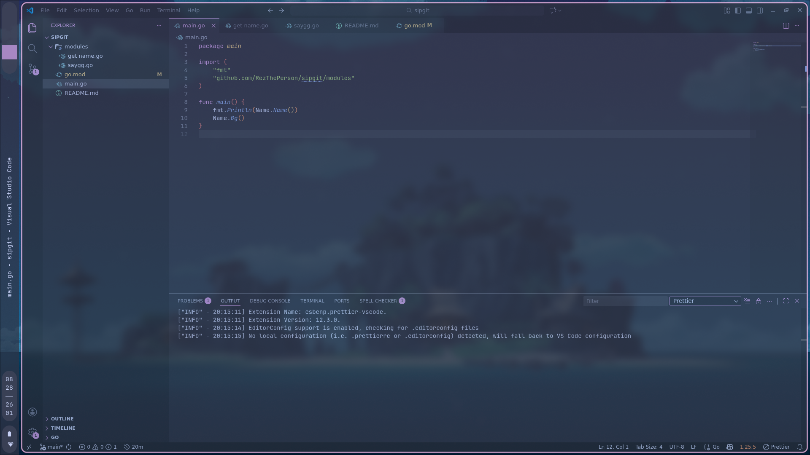
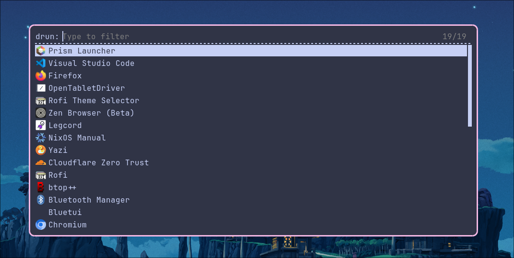
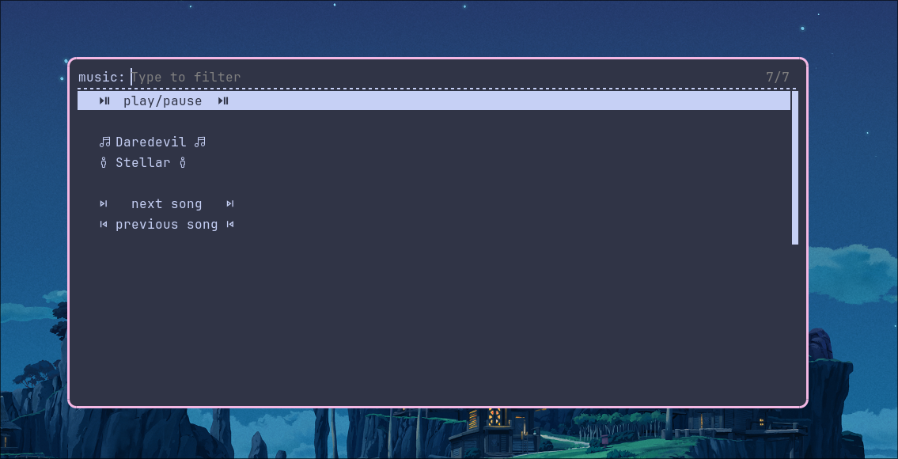
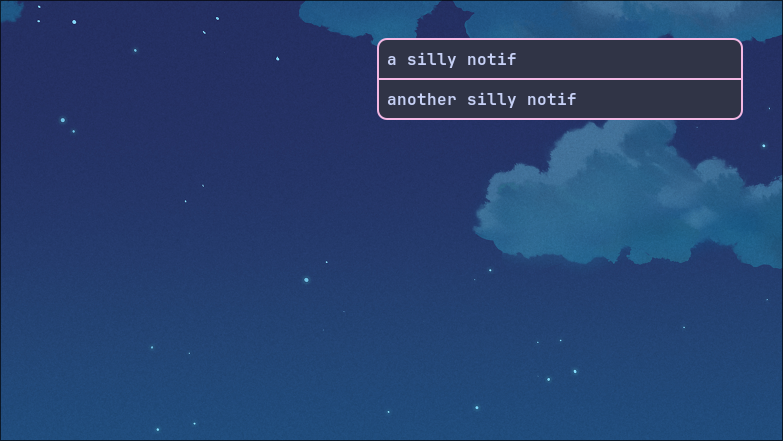
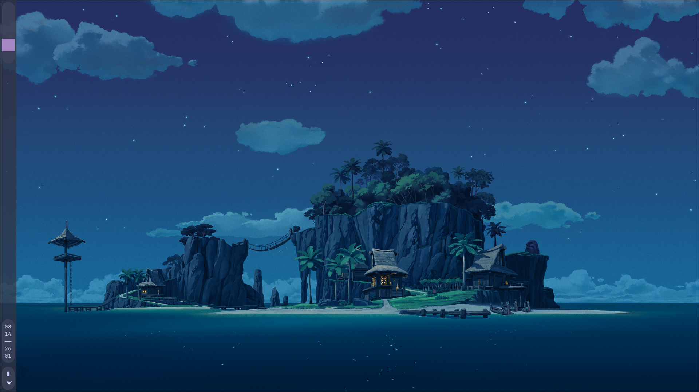

# burnt toast

my fried linux rice thats also somehow burnt toast :3

idk why thats the name of it

# actual discription

- tiling based WM (hyprland)
- catppuccin mocha theme
- uh custom script for [music control](dotfiles/scripts/.scripts/music_control.py) and [volume control](dotfiles/scripts/.scripts/volume_control.py) ig
- ahm ahm yea thats it

# Showcase








# useage:

(will put it together in the nix files using homemanger some time latter)

install the following in whatever distro you use:

`hyprland
vscode
zen-browser
kitty
fastfetch
eza
git
starship
stow
zsh
pay-respects
wl-clipboard
grim
slurp
cliphist
brightnessctl
playerctl
bluez
wireplumber
hyprpicker
hyprlock
hypridle
rofi
waybar
swaybg
libnotify
dunst
bibata-cursors
jetbrains-nerdmono-font`

create a backup of you current files

```bash
mv .config .config.bak
mv .backgrounds .backgrounds.bak
mv .scripts .scripts.bak
mv .zsh .zsh.bak
mv .zshrc .zshrc.bak
```

then bring my config

```bash
cd ~
git clone https://github.com/RezThePerson/burnt-toast.git
cd mv burnt-toast/dotfiles
stow -t ~/ *
cd ~
```

then logout and log back in and change you login manger's startup command to `start-hyprland`

# main keybinds

- super + D -> app launcher
- super + enter -> terminal
- super + number 1 thro 10 -> workspace 1 thro 10
- super + Q -> close window
- super + X -> volume change
- super + L -> lockscreen
- super + Z -> music control
- super + . -> emoji picker
- super + V -> clipboard
